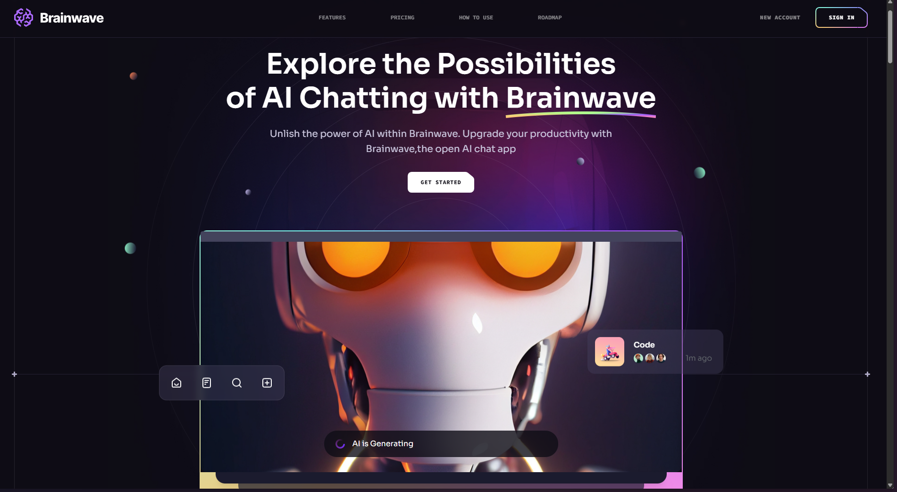
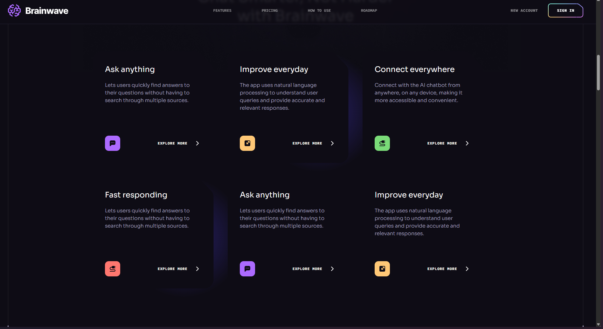

# Brainwave 💬

A modern and responsive landing page for an AI chatbot product. Built using **React** and **Tailwind CSS**, this project demonstrates a sleek, animated UI ideal for SaaS or AI startup frontends.

## 🚀 Live Demo

🌐 [Visit Live Site](https://brainwave-one-weld.vercel.app/)

---

## 📸 Screenshots

---

## 🧠 Features

- 🔥 Sleek landing page design
- 🎨 Responsive layout with Tailwind CSS
- 🌙 Light and dark mode toggle
- 📱 Mobile-first UI
- ⚡️ Framer Motion animations

---

## 🛠️ Tech Stack

- **React** – Frontend library
- **Tailwind CSS** – Utility-first CSS
- **Framer Motion** – Animation
- **Vite** – Fast development bundler

---

## 📂 Folder Structure (Simplified)
src/
├── assets/ # Images and icons
├── components/ # Reusable React components
├── sections/ # Page sections like Hero, Features, etc.
├── App.jsx
└── main.jsx
